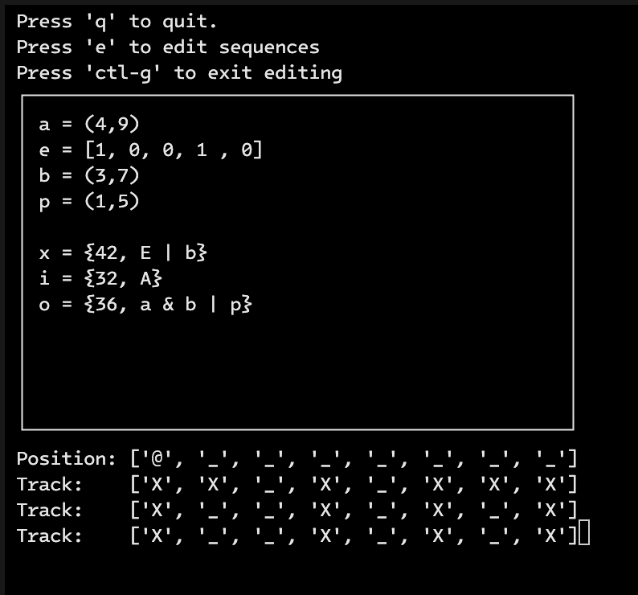

# Euclids Combinator Prototype

This is a sequencer that generates and combines sequences using euclidean algorithms or manual input. It uses logic operations like `&`, `^`, and `|` to combine sequences into tracks that trigger specific notes. Each part loops and is evaluated with the specified operator, allowing sequences of different lengths to phase and create complex rhythmic patterns. Where it gets really powerful is when combining sequences of different legnths and hear how the operations creates interesting evolving patterns.

For now, this is a Python prototype to explore the concept, with plans for a more suitable environment and GUI in the future.

## Usage

Run `python main.py`. Make sure you have a `Instructions.txt` in the same directory.
Edit the file `Instructions.txt` and save, this will trigger a re-import of the file.
`p` pauses the sequences
`q` exits the program, or use `ctl-c` in the console.
press `e` to edit directly in the terminal and press ctl-g for exit edit mode and write.

### Operators on sequences and tracks

For now part can be either a manual sequence or euclidean sequence. That can created by doing for example `A = [1,0,0,0]` for a manual sequence or `B = (5,6)` for a euclidean sequence.
Tracks are created with `{}` brackets.
Sequences have to be created before they can be used in tracks and can't be declared after a track either, as the document is evaluated from top to bottom.

To combine the parts assign them to a track with a note value and operatros.
for example `t1 = {36, A|B}`
This will create a track that triggers note 36 and is a combination of `A` or `B`.
Operators to use for now are `&` and, `|` or, `^` xor.

## Code concepts

Below is an overview of the conceps in the code.

### Part

A part is either a euclidean sequnece or manual entered sequence of any length. Its a list of 1's and 0's. 1 means trigger, 0 means don't do anything

## Instructions

Instructions are how parts are combined together and how they should be evaluated. These are savded in a dictionary so that any track can easily access them. They're assigned to a track when a track is processed.

### Track

A track holds an instruction set of which parts should be combined and in what order. They hold a note as well which is the one triggered when a Instruction set returns 1 from the parts. A track doesn't hold a length, it will just querry a part at the position the sequence is in. All Parts loop wrap around themselves.

This way if a part is 6 triggers long and one is 8, the Sequencer position being at 7 will querry the first part at position 0 in the list, and at 7 in the second one.
This can create interesting pattern variations and polythimcal feels.

### Sequence

is the beat that runs all the Tracks. Tracks are added to the sequence.
